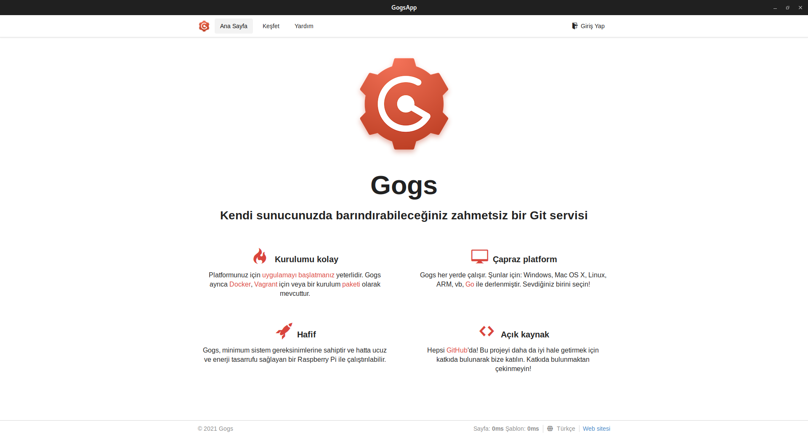

# gogsapp

Unofficial desktop gui app of Gogs

# Requirements

gtk3-devel

webkit2gtk3-devel

The gogs server must be installed and running on http://localhost:3000/

The gogs installation: https://gogs.io/docs/installation

# Download

git clone https://gitlab.com/fuatboluk/gogsapp.git

# Build

cd gogsapp

make

sudo make install

# Extra

custom/templates/home.tmpl, must be added to the Gogs working directory for the Turkish homepage, and the Gogs server must be restarted! 

# End
